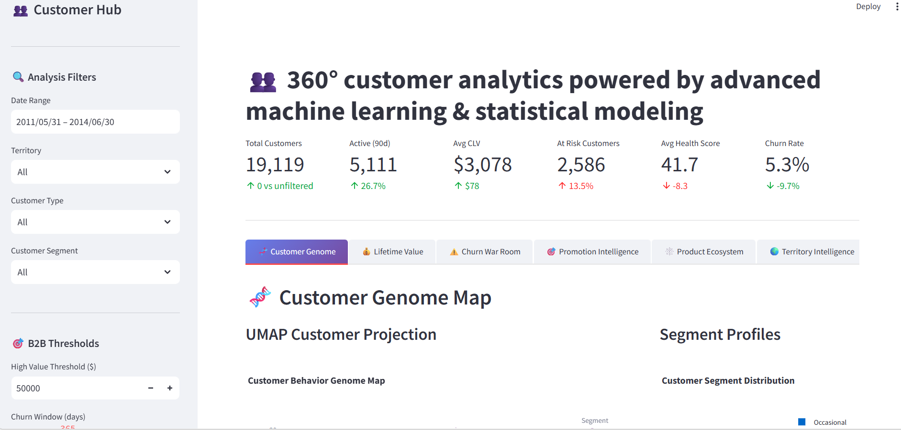
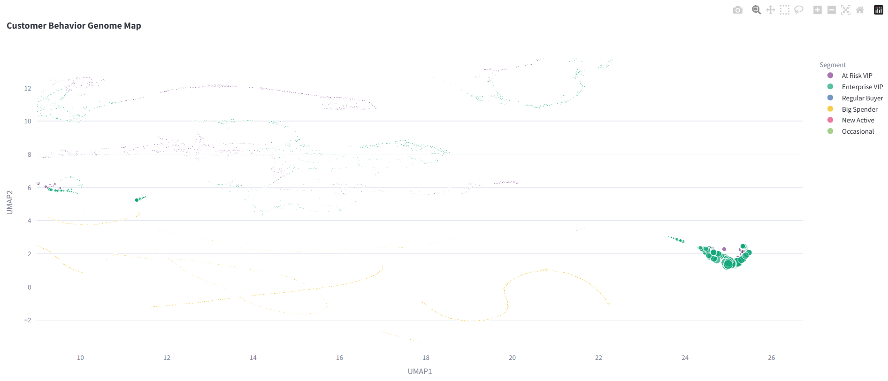
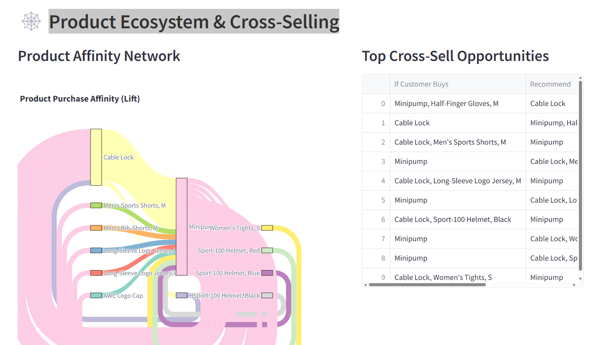

# Customer Value Intelligence Hub

A comprehensive customer analytics dashboard that transforms raw transaction data into actionable business intelligence, combining Streamlit web development with advanced data analytics (CLV modeling, churn prediction, market basket analysis, and customer segmentation).

## Screenshots





## Dashboard Features

| Feature | Description |
|---------|-------------|
| Customer Genome Map | UMAP clustering visualizing 19,000+ customers by behavior patterns |
| Lifetime Value (CLV) | Pareto/NBD model predicting customer lifetime value with confidence intervals |
| Churn War Room | Risk factor identification + retention ROI simulator |
| Promotion Intelligence | Discount effectiveness analysis + persuasion quadrant segmentation |
| Product Ecosystem | Market basket analysis + product affinity chord diagram |
| Territory Intelligence | Regional performance + cohort retention heatmaps |

## Key Metrics Calculated

- Customer Lifetime Value (CLV) with confidence intervals
- Churn probability & risk segmentation
- RFM (Recency, Frequency, Monetary) scores
- Customer health scores (0-100)
- Revenue concentration (Pareto analysis)
- Product affinity (lift & confidence)
- Cohort retention rates
- Promotion ROI simulation

## Technology Stack

| Component | Technology |
|-----------|------------|
| Frontend | Streamlit |
| Backend | Python 3.11 |
| Database | SQL Server (AdventureWorks2014) |
| ML/Analytics | scikit-learn, UMAP, HDBSCAN, lifelines, mlxtend |
| Visualization | Plotly, Plotly Express |
| Data Processing | Pandas, NumPy, SciPy |

## Installation

### Prerequisites

- Python 3.11 or higher
- SQL Server with AdventureWorks2014 database

### Setup

1. Clone the repository
```bash
git clone https://github.com/WryaV/customer-value-hub.git
